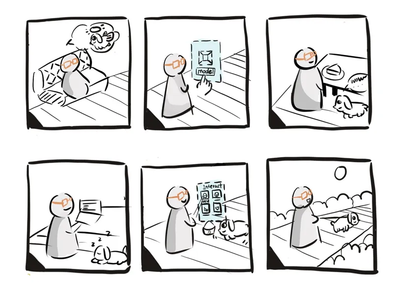
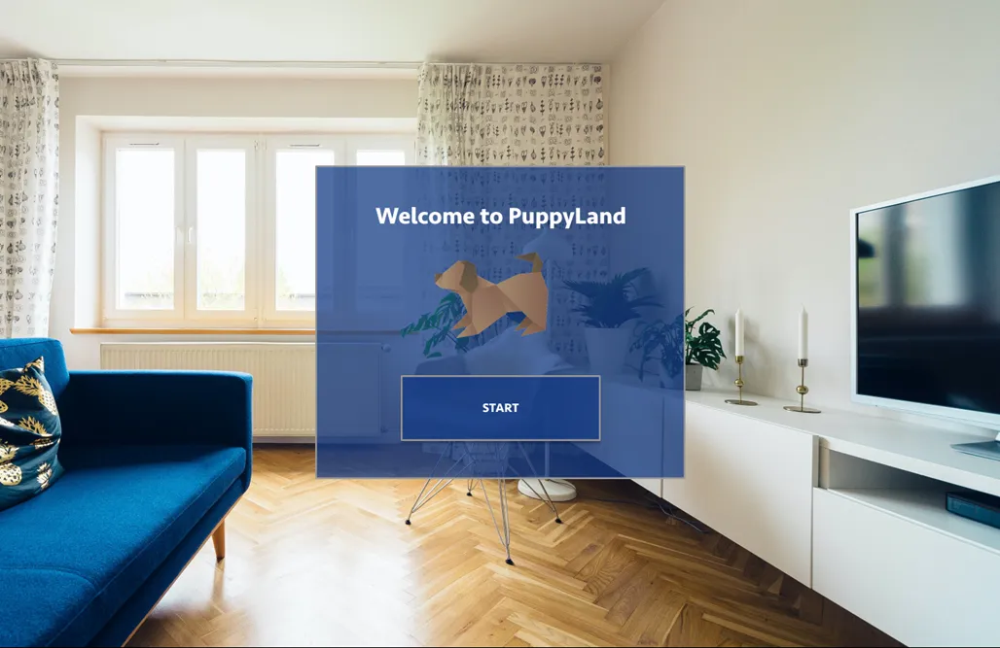
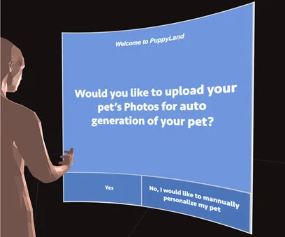
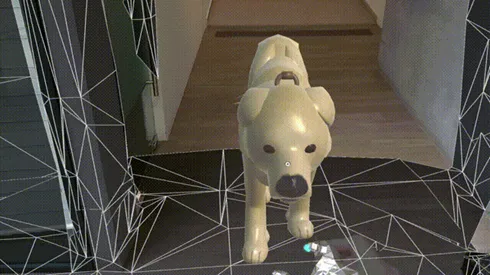
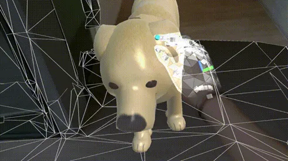

# **PuppyLand**

## **Quick Start Guide**

- Fork the github repo

- Open it in unity

## **Engineering Complexity**

- Created the animation for dog's model

- Basic Obstacle detections

- Gesture interaction with the pet

## **Background**

There are Three million pets passed away every year, with an average of nearly 10,000 pets leaving the world every day.

With the rapidly development of pets industry, there are many services supported in the market, such as commemorate, online video sharing, dog competition and more.

We would like to help pet owners interact with the pet while model their dead pets for accompanying the owner.

### **User Need Analysis**

- **Authenticity** Hard to find the same breed dogs with similar personality and habits

- **Accompany** Median longevity ranges from 10 to 13 years

- **Entertainment** New dogs can not inherit the precious memories

## **PuppyLand**

It provides an identical digital dog with the same memory, habits, and patterns of the original dog.

The digital dog has unlimited life time.

You can choose the feature of the dog at any point of its life, when its a puppy, grown-up, or elderly.

Detect the environment and adjust accordingly, gets muddy in rainy days.

It is faster than a clone, only takes a few hours to generate your new dog.

There are no moral issues and affordable than clone, it can become a popularized product.

## **Storyboard**

## **AR in Hololens**

|  |
|:--:| 
| *welcome page for PuppyLand* |

|  |
|:--:| 
| *third party view of the application* |

|  |
|:--:| 
| *interact with model in HoloLens2* |

|  |
|:--:| 
| *touch model in HoloLens2* |

## **Future work**

Eye gazing to trigger different functions of the system.

Use scene analysis and trigger the scenario of behaviors under that circumstance. Such as detect books, laptops, and desk, pet will come over and stay around the owner; detect other dogs, bark towards smaller dogs and avoid larger dogs.

Object detection in virtual world — interaction with the virtual object.
